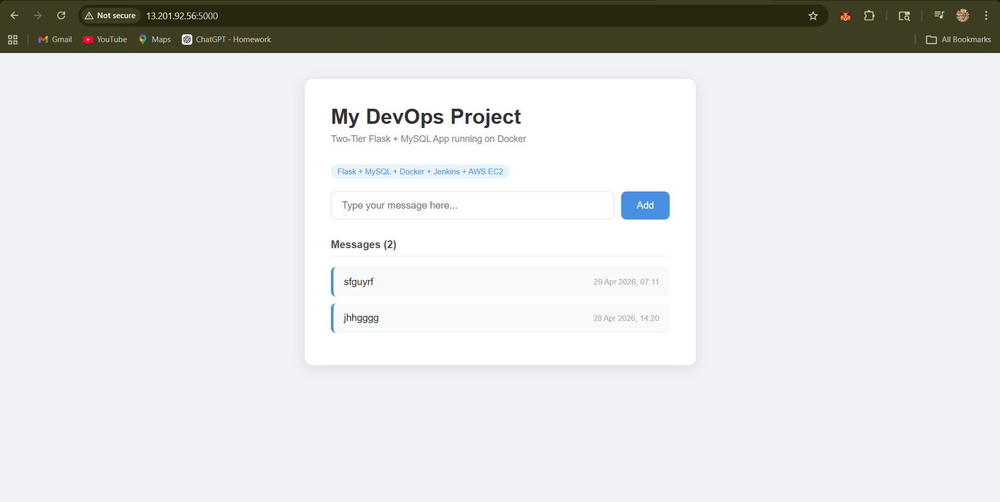
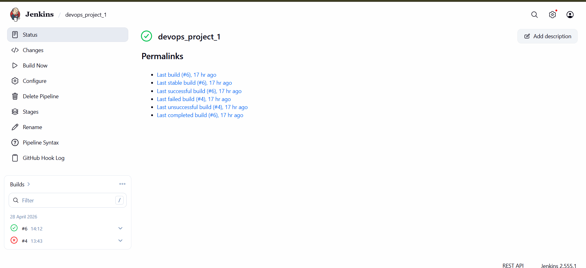
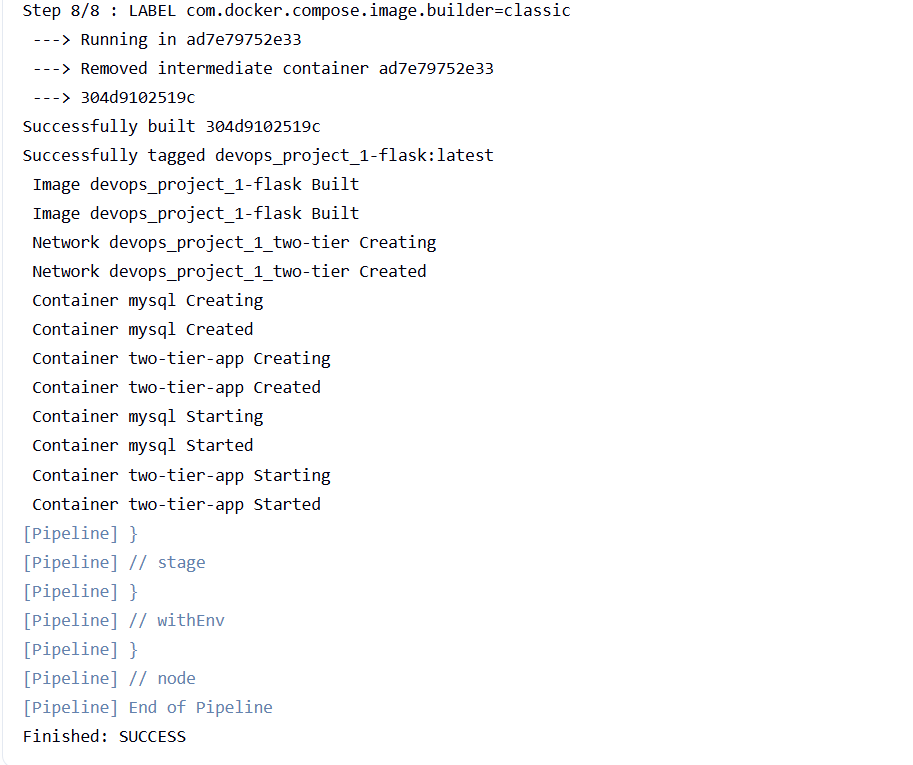
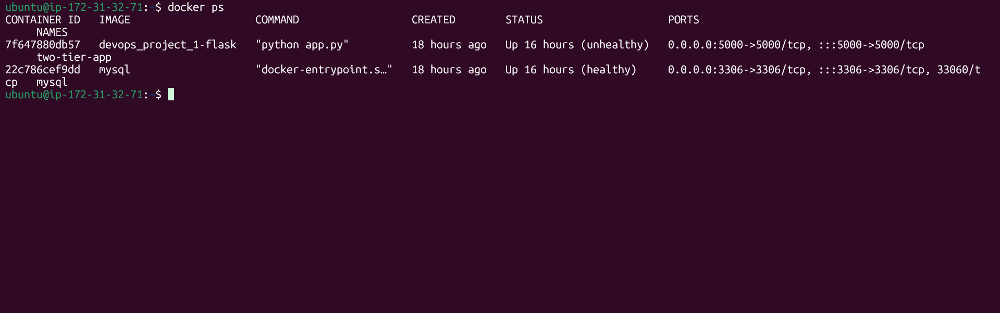
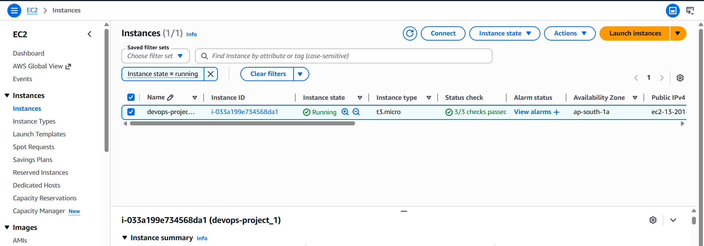

# Two-Tier Flask DevOps Pipeline on AWS EC2

A production-style DevOps project demonstrating a fully automated CI/CD pipeline.
Every code push to GitHub automatically builds and deploys a containerized Flask + MySQL application on AWS EC2 — with zero manual intervention.

---

## 📸 Live Project Screenshots

### ✅ Live Application

> Flask web app running on AWS EC2 — messages stored in MySQL database

---

### ✅ Jenkins CI/CD Pipeline

> Jenkins pipeline showing successful build #6 — fully automated

---

### ✅ Jenkins Console Output

> Pipeline console showing Docker build, container creation and `Finished: SUCCESS`

---

### ✅ Docker Containers Running

> Both Flask and MySQL containers running on AWS EC2

---

### ✅ AWS EC2 Instance

> EC2 instance running in ap-south-1 (Mumbai) region — 3/3 status checks passed

---

## 🏗️ Architecture

```
┌─────────────────────────────────────────────────────────────────┐
│                        DEVELOPER MACHINE                        │
│                        git push                                 │
└──────────────────────────────┬──────────────────────────────────┘
                               │ webhook
                               ▼
┌─────────────────────────────────────────────────────────────────┐
│                         GITHUB REPO                             │
│              kandukuriDinakarreddy/devops_project_1             │
│         Stores: app.py | Dockerfile | docker-compose.yml        │
│                         Jenkinsfile                             │
└──────────────────────────────┬──────────────────────────────────┘
                               │ triggers
                               ▼
┌─────────────────────────────────────────────────────────────────┐
│                    AWS EC2 (Ubuntu 22.04)                       │
│                                                                 │
│   ┌─────────────────────────────────────────────────────────┐  │
│   │               JENKINS SERVER (:8080)                    │  │
│   │  Stage 1: Build Docker Image                            │  │
│   │      └─▶ Stage 2: Deploy with Docker Compose            │  │
│   └──────────────────────┬──────────────────────────────────┘  │
│                          │ deploys                              │
│                          ▼                                      │
│   ┌──────────────────────────────────────────────────────────┐ │
│   │           DOCKER COMPOSE NETWORK (two-tier)              │ │
│   │                                                          │ │
│   │  ┌─────────────────────┐   ┌────────────────────────┐   │ │
│   │  │  Flask Container    │──▶│   MySQL Container      │   │ │
│   │  │  Port: 5000         │   │   Port: 3306           │   │ │
│   │  │  Health: /health    │   │   Volume: mysql-data   │   │ │
│   │  └─────────────────────┘   └────────────────────────┘   │ │
│   └──────────────────────────────────────────────────────────┘ │
└─────────────────────────────────────────────────────────────────┘
                         │
                         ▼
              http://EC2-PUBLIC-IP:5000
```

---

## ⚙️ Jenkins CI/CD Pipeline

The `Jenkinsfile` defines 2 automated stages:

```groovy
pipeline {
    agent any
    stages {
        stage('Build Docker Image') {
            steps {
                sh 'docker build -t flask-app:latest .'
            }
        }
        stage('Deploy with Docker Compose') {
            steps {
                sh 'docker-compose down || true'
                sh 'docker-compose up -d --build'
            }
        }
    }
}
```

### Pipeline Flow

```
git push to GitHub
       │
       ▼
GitHub Webhook triggers Jenkins automatically
       │
       ├──▶ Stage 1: Build Docker Image
       │         • Reads Dockerfile
       │         • Installs Python dependencies
       │         • Creates flask-app:latest image
       │
       └──▶ Stage 2: Deploy with Docker Compose
                 • Stops existing containers
                 • Starts fresh Flask + MySQL containers
                 • App live at :5000
```

**Webhook:** GitHub sends POST to `http://EC2-IP:8080/github-webhook/`
Pipeline starts **automatically within 10 seconds of every push.**

---

## 🛠️ Tech Stack

| Layer | Technology | Purpose |
|-------|-----------|---------|
| Application | Python Flask | Web framework |
| Database | MySQL | Persistent data storage |
| Containerization | Docker | Package app + dependencies |
| Orchestration | Docker Compose | Run multi-container app |
| CI/CD | Jenkins | Automate build and deploy |
| Version Control | GitHub | Source code + webhook trigger |
| Cloud | AWS EC2 (t2.micro) | Host everything |
| OS | Ubuntu 22.04 LTS | Server operating system |

---

## 📁 Project Structure

```
devops_project_1/
├── app.py                 # Flask app with MySQL retry logic
├── requirements.txt       # flask, mysql-connector-python
├── Dockerfile             # Lightweight python:3.9-slim image
├── docker-compose.yml     # Flask + MySQL with healthchecks
├── Jenkinsfile            # 2-stage CI/CD pipeline
├── screenshots/           # Project screenshots
└── templates/
    └── index.html         # Frontend UI
```

---

## 🚀 How to Run Locally

```bash
# Clone
git clone https://github.com/kandukuriDinakarreddy/devops_project_1.git
cd devops_project_1

# Run
docker-compose up -d --build

# Open browser
http://localhost:5000

# Stop
docker-compose down
```

**Requirements:** Docker and Docker Compose installed.

---

## ☁️ AWS Infrastructure

| Setting | Value |
|---------|-------|
| Instance | t2.micro — Free Tier |
| OS | Ubuntu 22.04 LTS |
| Region | ap-south-1 (Mumbai) |
| Swap | 2GB added manually |
| Open Ports | 22 (SSH), 8080 (Jenkins), 5000 (App) |

---

## 🔧 Key DevOps Concepts Demonstrated

- **CI/CD Pipeline** — Automated build and deploy on every commit
- **Containerization** — Consistent environment via Docker
- **Webhook Integration** — GitHub notifies Jenkins automatically
- **Health Checks** — Both containers monitored for readiness
- **Data Persistence** — MySQL data survives restarts via volumes
- **Network Isolation** — Private Docker network between containers
- **Cloud Deployment** — Hosted on real AWS infrastructure

---

## 📌 Planned Improvements

- [ ] Kubernetes deployment
- [ ] Prometheus + Grafana monitoring
- [ ] Terraform for infrastructure provisioning
- [ ] Nginx reverse proxy + HTTPS

---

## 👤 Author

**Kandukuri Dinakar Reddy**
GitHub: [@kandukuriDinakarreddy](https://github.com/kandukuriDinakarreddy)
